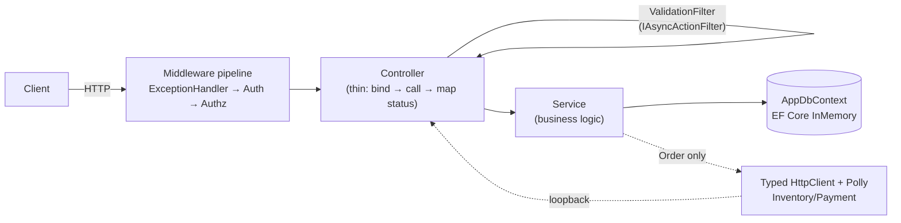

# Architecture & Patterns

How `Genasys.Api` is put together, and why. For the data model and API
surface see [`plan/order-processing-service-plan.md`](plan/order-processing-service-plan.md);
this doc is about the *code* structure — layering, composition, and the
patterns chosen at each seam. Diagrams referenced here live under
[`diagrams/`](diagrams/).

## Shape: single project, folder-separated

Round-1 choice, deliberately not a multi-project Clean/Onion/Hexagonal
split. Six controllers and a handful of services don't yet justify the
project-reference ceremony a multi-project split brings — that's a round-2
direction once the domain has grown enough to earn it.

```
Genasys.Api/
  Program.cs                 composition root — reads as a table of contents
  Configuration/              WebApplicationBuilder/WebApplication extension methods
  Controllers/                thin — map request -> service call -> map result -> status code
  Services/
    Contracts/                IOrderService, IInventoryService, IPaymentService, IProductService, ICustomerService, IAuthService
    *.cs                      OrderService, InventoryService, PaymentService, ProductService, CustomerService, AuthService
  Clients/                    IInventoryApiClient/IPaymentApiClient + typed HttpClient implementations
  Data/
    Configurations/           IEntityTypeConfiguration<T> per entity
    Seed/                     DataSeeder
    AppDbContext.cs
  Entities/
    Contracts/                IHasRowVersion
    *.cs                      POCOs + enums
  Contracts/                  request/response DTOs, PagedResult<T>/PagedRequest (per-resource subfolders)
  Validators/                 FluentValidation validators
  Filters/                    ValidationFilter
  Common/                     DomainExceptions, GlobalExceptionHandler, KeyedLockProvider, AddressMapper, SortSpec, JwtOptions, AuthHeaderPropagationHandler
```

Interfaces are split into a `Contracts/` sub-namespace from their
implementations, in both `Services/` and `Entities/` — a consumer importing
`Genasys.Api.Services.Contracts` sees only the seam it depends on, not the
concrete class sitting next to it.

## Composition root

`Program.cs` is intentionally 12 lines — every concern is a chained
extension method on `WebApplicationBuilder` or `WebApplication`, defined in
`Configuration/WebApplicationBuilderExtensions.cs` and
`WebApplicationExtensions.cs`:

```csharp
builder
    .ConfigureControllers()
    .ConfigureSwagger()
    .ConfigureDatabase()
    .ConfigureCaching()
    .ConfigureExceptionHandling()
    .ConfigureApplicationServices()
    .ConfigureHttpClients()
    .ConfigureAuthentication()
    .ConfigureAuthorization();

var app = builder.Build();
await app.WithSeededDatabaseAsync();
app.WithErrorHandling().WithSwaggerDocs().WithSecurityPipeline().WithEndpoints();
app.Run();
```

This is the **fluent builder pattern applied to the composition root** — the
point isn't cleverness, it's that `Program.cs` reads like a table of
contents instead of fifty lines of `builder.Services.Add*`, and each concern
(auth, caching, HTTP clients...) is independently testable/removable.

## Layered request flow



The `OrderController → OrderService → (Inventory/Payment over real HTTP) →
InventoryController/PaymentController → their services` loop is the one
non-obvious edge: `OrderService` never touches `InventoryService`/
`PaymentService` directly (except for the post-payment `ConsumeReservationsAsync`
call, see [resilience-and-consistency.md](resilience-and-consistency.md)) —
it goes back out over `HttpClient`, satisfying the spec's explicit
inter-service HTTP client requirement even though everything is one process
on one loopback address.

## Design decisions and why

| Decision | Choice | Rejected alternative | Why |
|---|---|---|---|
| Business logic pattern | Plain service classes (interface + impl per resource) | CQRS/MediatR | Straightforward to trace and test; this is mostly CRUD plus one genuinely complex flow (order creation) — command/handler indirection buys little at this scope |
| Data access | Services take `AppDbContext` directly | Generic `Repository<T>` | `DbContext` already *is* a Repository + Unit of Work; wrapping it again is a well-known anti-pattern that hides EF Core's change tracking for no real abstraction benefit here |
| Error handling | Domain exceptions (`Common/DomainExceptions.cs`) + a single global `IExceptionHandler` | `Result<T>` threaded through every method | `InsufficientInventoryException`, `PaymentFailedException`, etc. are thrown from services, caught once in `GlobalExceptionHandler`, mapped to the right `ProblemDetails` + status code — no `.IsSuccess` checks scattered through every controller/service call site |
| Mapping | Manual `ToResponse()` private static methods per service | AutoMapper | Explicit and debuggable; nothing here is complex enough to justify a mapping-convention dependency |
| Validation | FluentValidation via a global `IAsyncActionFilter` (`Filters/ValidationFilter.cs`) | DataAnnotations, or FluentValidation's (deprecated) MVC auto-binding package | One `AbstractValidator<T>` per request DTO, resolved by reflection off the action's argument type, short-circuits with RFC 7807 `ValidationProblemDetails` before the action body runs — no repeated `if (!ModelState.IsValid)` |
| Inter-service calls | Typed `HttpClient` per resource (`AddHttpClient<T>`) with a Polly retry policy | Direct in-process service-to-service calls | Satisfies the spec's explicit HTTP-client requirement; the retry policy is also where the "service unavailable" error scenario gets real behavior instead of an immediate failure (tradeoffs of this choice are covered in [resilience-and-consistency.md](resilience-and-consistency.md)) |
| Concurrency control | Per-product async keyed lock (`Common/KeyedLockProvider.cs`) + `RowVersion` optimistic concurrency token, auto-bumped in `AppDbContext.SaveChanges` | Database-level row locking (not available/meaningful on EF InMemory) | The keyed lock serializes the actual race (two orders reserving the same product); `RowVersion` is a second line of defense against any other concurrent writer |
| Auth | Self-issued JWT (`JwtBearer` + `/api/auth/token`), `User` entity deliberately separate from `Customer` | Keycloak / external IdP | Covers the JWT bonus without a container dependency; see [auth-and-security.md](auth-and-security.md) for the full reasoning |

## Cross-cutting concerns and where they live

| Concern | Implementation |
|---|---|
| Validation | `Filters/ValidationFilter.cs`, one `AbstractValidator<T>` per DTO in `Validators/` |
| Error mapping | `Common/GlobalExceptionHandler.cs` (`IExceptionHandler`, .NET 8) |
| Auth | `Services/AuthService.cs`, `Common/JwtOptions.cs`, `Common/AuthHeaderPropagationHandler.cs` |
| Concurrency | `Common/KeyedLockProvider.cs`, `Entities/Contracts/IHasRowVersion.cs`, `Data/AppDbContext.cs` (`BumpRowVersions`) |
| Idempotency | `IdempotencyKey` column + unique index on `Order`/`PaymentTransaction`, checked at the top of `OrderService.CreateAsync`/`PaymentService.ProcessAsync` |
| Caching | `IMemoryCache` in `ProductService.GetByIdAsync` (30s TTL, single-item reads only) |
| Soft delete | `IsDeleted` + EF Core global query filter on `Product`/`Customer` |
| Audit trail | `OrderStatusHistory`, `CreatedAt`/`UpdatedAt` on every entity |
| Logging | `ILogger<T>` throughout services, structured message templates (no string interpolation into log messages) |

## Related docs

- [diagrams/class-diagram.md](diagrams/class-diagram.md) — entity model + service/controller layer as UML
- [diagrams/sequence-diagrams.md](diagrams/sequence-diagrams.md) — auth, order creation (all outcomes), idempotent replay
- [diagrams/flowcharts.md](diagrams/flowcharts.md) — control flow through the key service methods
- [auth-and-security.md](auth-and-security.md) — JWT, roles, password hashing, inter-service auth propagation
- [resilience-and-consistency.md](resilience-and-consistency.md) — idempotency, retries, cancellation, concurrency
- [testing.md](testing.md) — what's tested, how, and what's deliberately not yet covered
