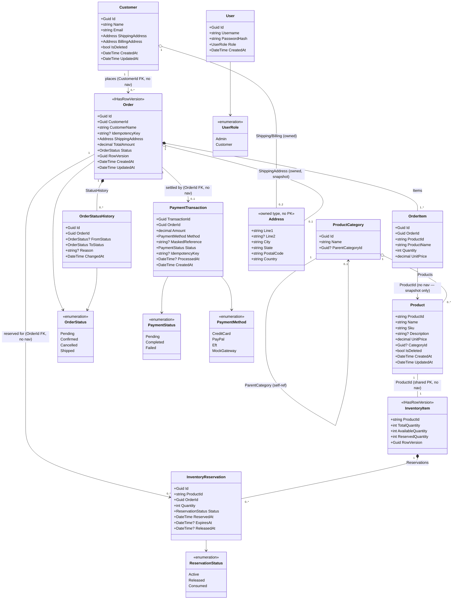
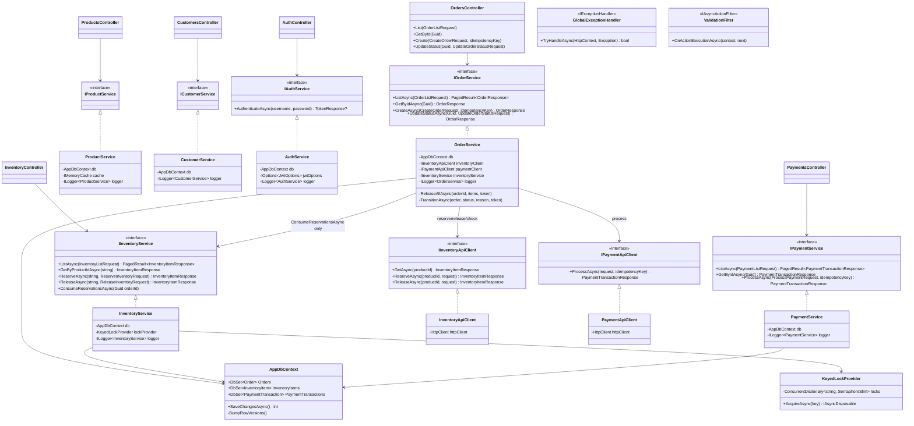

# UML Class Diagrams

Two views: the persisted domain model (`Entities/`), and the
service/controller layer that operates on it. Diagram source is Mermaid —
renders directly on GitHub.

## Domain model

Two things worth calling out that aren't obvious from the diagram alone:

- **`User` has no relationship to `Customer`.** This is deliberate — see
  [auth-and-security.md](../auth-and-security.md#user-vs-customer) for the
  reasoning. They're on separate axes: `User` is *who's calling the API*,
  `Customer` is *who the order is for*.
- **Several FKs (`OrderId` on `InventoryReservation`/`PaymentTransaction`,
  `ProductId` on `OrderItem`) have no EF navigation property back to the
  parent.** That's intentional — `OrderItem`/`OrderStatusHistory` snapshot
  what they need (`ProductName`, `UnitPrice`) rather than dereferencing a
  live `Product`, so a later edit or soft-delete can't rewrite a historical
  order.

## Service / controller layer

Note the asymmetry in how `OrderService` reaches Inventory: for the
*reserve/release/availability-check* path it goes through
`IInventoryApiClient` (a real HTTP round-trip to `InventoryController`), but
for `ConsumeReservationsAsync` — turning a payment-confirmed order's
reservations into a permanent stock decrement — it calls `IInventoryService`
directly, in-process. That's not an oversight; `ConsumeReservationsAsync`
isn't part of the spec's inventory API surface (there's no
`POST /api/inventory/{id}/consume` endpoint), it's an internal step of order
confirmation, so there's no HTTP boundary to cross for it in the first
place.

See [sequence-diagrams.md](sequence-diagrams.md) for how these classes
interact at runtime, and [flowcharts.md](flowcharts.md) for the internal
control flow of the more complex methods (`OrderService.CreateAsync`
especially).
