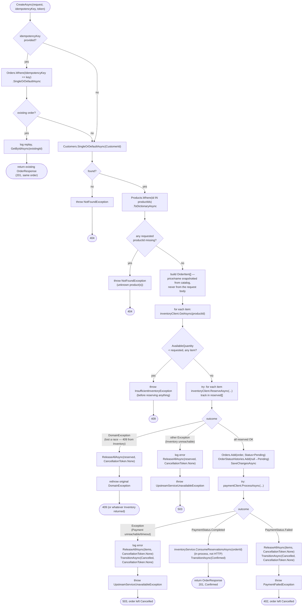
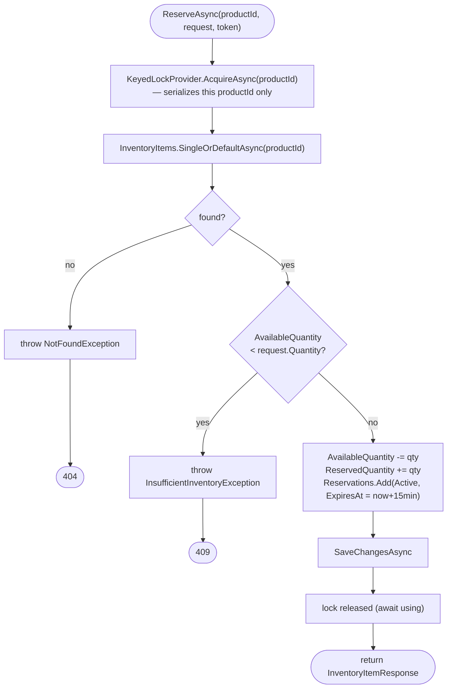
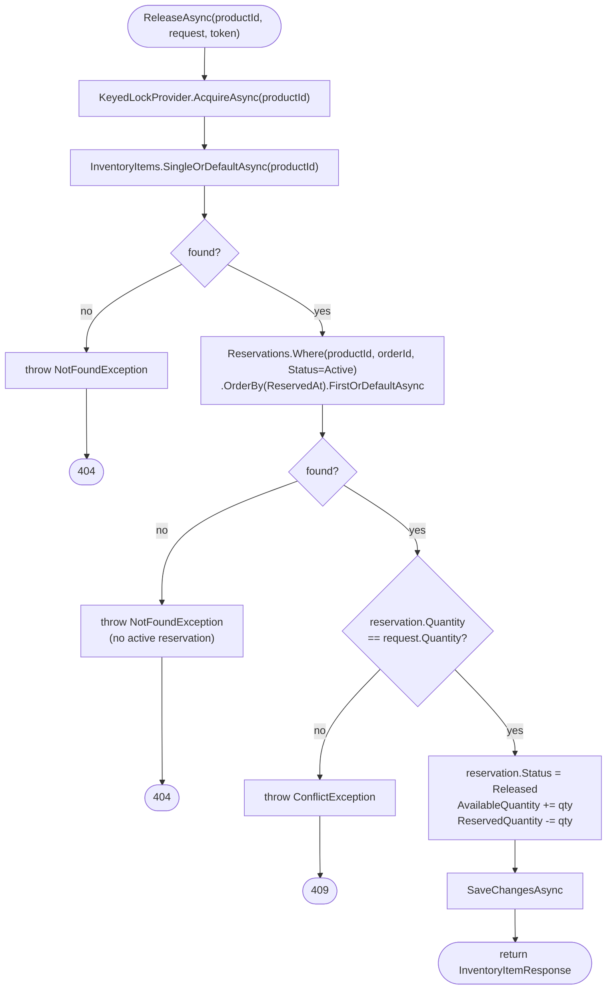
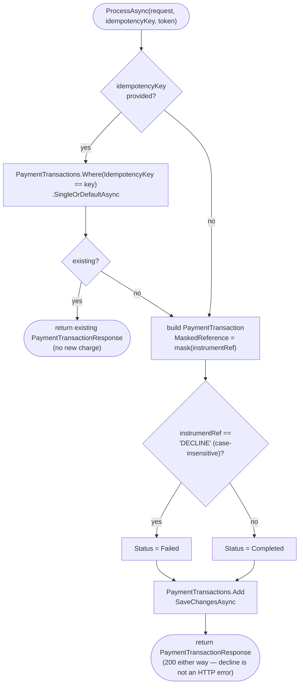
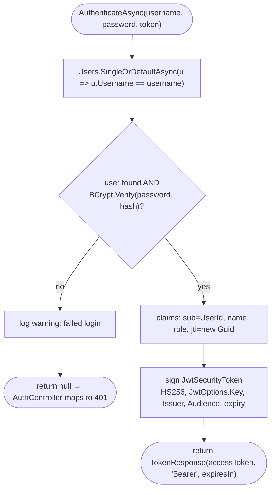

# Service Method Flowcharts

Control-flow detail for the methods that do more than a CRUD pass-through.
These are the methods worth understanding branch-by-branch; simple
list/get/create/update/delete methods on `ProductService`/`CustomerService`
aren't diagrammed here — they're straightforward EF Core CRUD with
validation and (for Product) a cache read-through.

## `OrderService.CreateAsync`

The one method that justifies this whole documentation set — every error
scenario in the spec funnels through here.

Three details this diagram makes explicit that are easy to miss reading the
code top-to-bottom:

1. **Two different exception-handling shapes in the same method** — the
   reservation loop distinguishes `DomainException` (a real business
   rejection, like losing a race for the last unit — rethrown as-is) from
   any other exception (treated as "Inventory is unreachable" and mapped to
   `503`). The payment call doesn't make that distinction because
   `IPaymentApiClient.ProcessAsync` never throws a domain exception for a
   *declined* payment — a decline is a normal `200` response with
   `Status: "Failed"`, handled in the success branch. Only a genuinely
   broken payment service throws.
2. **Every compensation call uses `CancellationToken.None`, not the
   request's token.** If the original request is cancelled partway through,
   the code must still finish releasing inventory and marking the order
   `Cancelled` — using the (now-cancelled) request token there would let the
   cleanup itself get cancelled, stranding held stock against a `Pending`
   order forever. Full writeup: [resilience-and-consistency.md](../resilience-and-consistency.md#cancellation-can-prevent-compensation).
3. **The availability check and the reservation loop are two separate
   passes.** Checking `GET /inventory/{id}` for every item *before*
   reserving any of them means a doomed order (item 3 of 3 is out of stock)
   never partially reserves items 1 and 2 in the first place — the
   reservation loop only exists to handle the race where availability
   changed *between* the check and the reserve call.

## `InventoryService.ReserveAsync`

The lock is what makes the "two orders race for the last unit" scenario
safe: both requests call `ReserveAsync` for the same `productId`, but the
second one blocks on `AcquireAsync` until the first has committed its debit
— so the second sees the *updated* `AvailableQuantity`, not a stale read.
Proven by `InventoryServiceTests`' concurrency test (two simultaneous
reservations, only one succeeds).

## `InventoryService.ReleaseAsync`

Release targets a *specific reservation row* (matched on `productId` +
`orderId`, earliest first), not a bare decrement — releasing order A's hold
can never accidentally touch order B's, even if both reserved the same
product.

## `PaymentService.ProcessAsync`

The `DECLINE` sentinel is the entire "payment gateway" — there's no real
processor. `MaskedReference` (`**** 4242` shape) is stored instead of
`InstrumentReference`; the raw value is never persisted.

## `AuthService.AuthenticateAsync`

