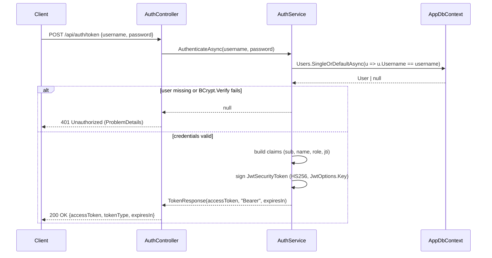
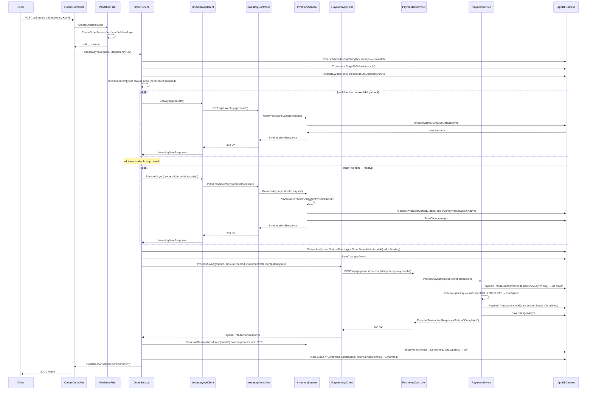
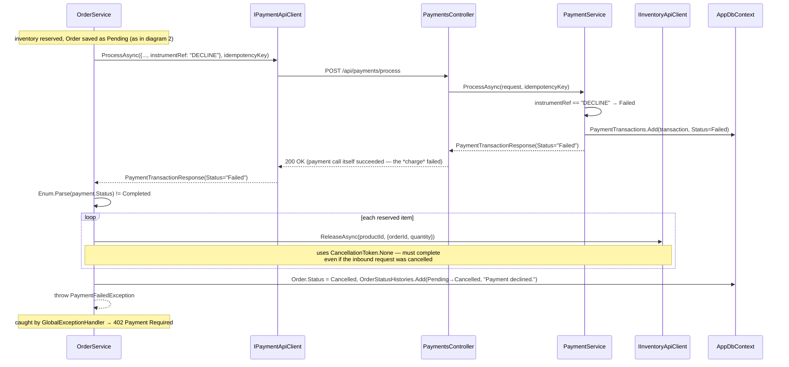
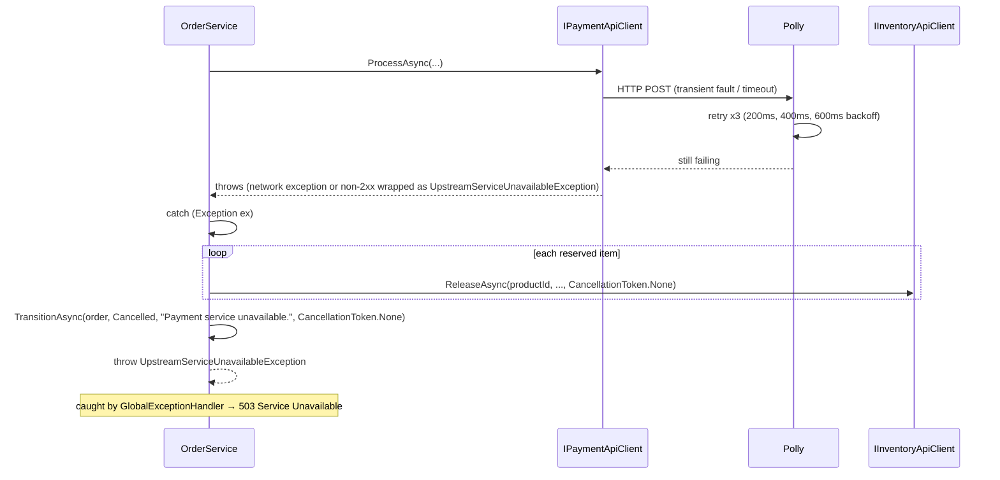
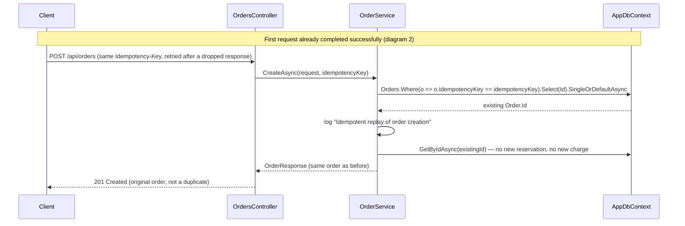

# Sequence Diagrams

Runtime interactions between the classes in
[class-diagram.md](class-diagram.md), using their real names so this maps
1:1 onto the source. All diagrams assume a valid bearer token unless the
scenario is specifically about auth.

## 1. Auth — token issuance

Every endpoint except this one requires the resulting bearer token — see
[auth-and-security.md](../auth-and-security.md) for how the token is
verified on the way back in.

## 2. Order creation — happy path

The full success path, showing the real HTTP hops between
`OrderController` and `InventoryController`/`PaymentsController` (loopback,
but not in-process calls — see [architecture.md](../architecture.md#layered-request-flow)).

## 3. Order creation — payment declined

Diverges from step "loop each line item — reserve" onward in diagram 2.

## 4. Order creation — inventory/payment service unavailable

Two independent failure points collapse to the same shape: an exception
from the typed `HttpClient` call (after Polly's 3 retries are exhausted)
triggers compensation and a `503`.

The same shape applies if the *reservation* call itself throws (Inventory
service down before payment is ever attempted) — see
`OrderService.CreateAsync`'s first `try/catch` block, covered in
[flowcharts.md](flowcharts.md#orderservicecreateasync).

## 5. Idempotent replay

Without protection, two concurrent requests carrying the same key could
both pass the `SingleOrDefaultAsync` check above before either had saved,
and both create an order. `CreateAsync` guards against this by acquiring a
`KeyedLockProvider` lock scoped to the idempotency key *before* running this
whole sequence — not shown in the diagram above for clarity, since it wraps
the entire operation rather than a single step. See
[resilience-and-consistency.md](../resilience-and-consistency.md#idempotency)
for the full writeup, including why a unique database index alone
turned out not to be enough here.
