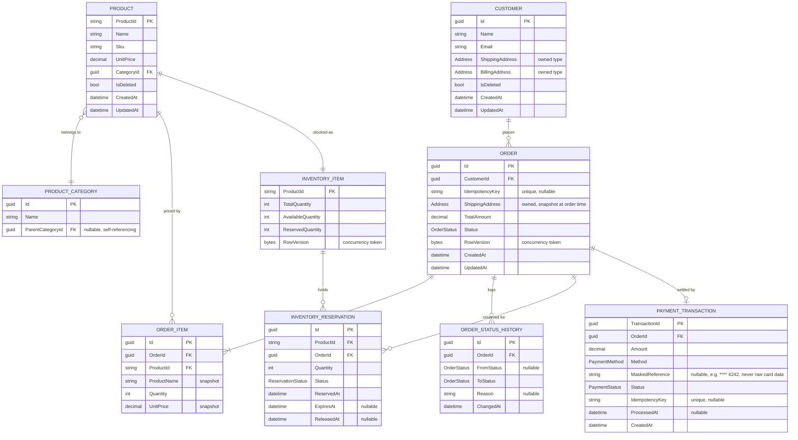
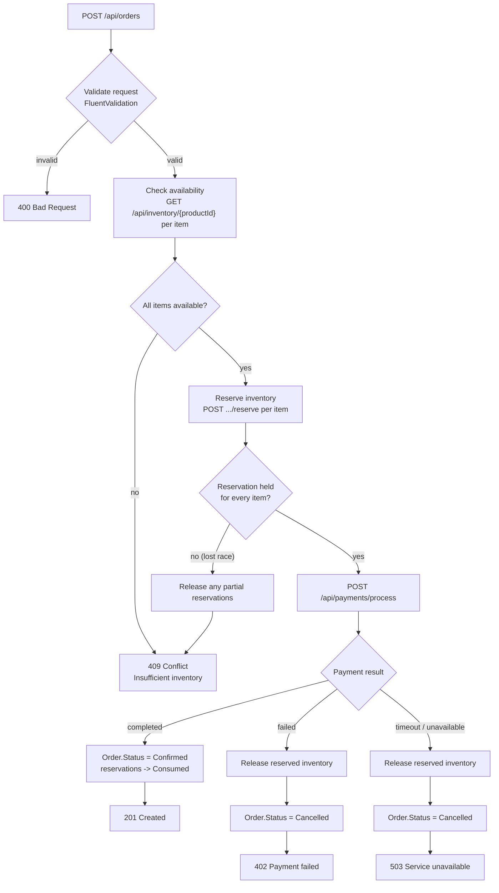
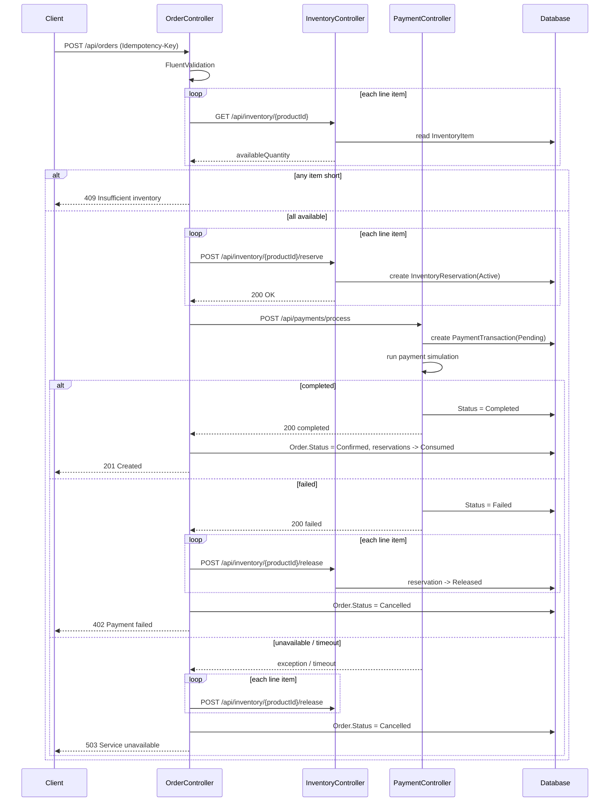
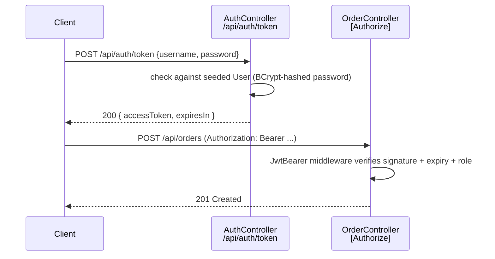

# Order Processing Service — Flow & Data Model Plan

Genasys C# Developer technical assessment, round 1. Order, Inventory, and
Payment controllers over ASP.NET Core, built to the spec in
`docs/Technical Assessment_C# Developer_July 2025 (1).pdf`, with the entity
model taken further toward something a real order system would look like.

Round-1 decisions: EF Core **InMemory** provider, self-issued **JWT** (no
Keycloak), **net8.0** target, full CRUD on Product/Customer. The
Postgres/Keycloak/multi-tenant scaffold has been removed from the repo — that
direction is parked for round 2.

## 1. Data models

The spec only defines `Order`, `Inventory Item`, and `Payment Transaction` as
JSON shapes. Everything below fills in what a working system needs
underneath them: referential entities (`Product`, `Customer`,
`ProductCategory`), an audit trail (`OrderStatusHistory`), a reservation
ledger instead of a bare counter (`InventoryReservation`), and an auth
principal separate from the business `Customer` (`User`).



`User` (login principal for the JWT bonus) is deliberately **not** wired to
`Customer` above — in a real system the account that authenticates against
the API (staff, an admin, a service account) isn't necessarily the business
entity an order is placed for. Keeping them separate avoids conflating "who's
calling the API" with "who the order belongs to".

```
USER
  Guid Id
  string Username        (unique)
  string PasswordHash    (BCrypt)
  Role  Role              enum: Admin | Customer
  datetime CreatedAt
```

Kept deliberately minimal — no self-registration endpoint, no password
reset flow, no `UserController`. It exists only so `/api/auth/token` checks
against a real (seeded) record instead of a hardcoded string, and so
mutating endpoints can require `[Authorize(Roles = "Admin")]` instead of any
authenticated caller. Linking a `User` to a `Customer` (customer
self-service login) is a clean future extension, not needed for this round.

### Terminology — User, Account, Customer are three different axes

IAM vocabulary tends to blur these together (a lot of consumer SaaS makes
"account" and "customer profile" the same row 1:1, which is where the habit
of conflating them comes from). Here they're kept separate on purpose:

| Term | Maps to | Answers |
|---|---|---|
| **User** | `User` entity | *Who's authenticating* — the credential holder calling the API (staff/admin) |
| **Account** | not modeled in round 1 | *Which tenant/org a User belongs to* — this is the parked Keycloak `Tenant` concept from round 2; a User-side, multi-tenancy concern |
| **Customer** | `Customer` entity | *Who the order is for* — a commerce entity with addresses and order history, unrelated to logging in |

Our `User`s act on behalf of many `Customer`s (a support agent manages
orders for hundreds of customers), so collapsing `User`/`Account` into
`Customer` would force every customer to carry login credentials they don't
need. If round 2 adds customer self-service login, the join point is a
nullable `CustomerId` on `User` — a link between two still-distinct
entities, not a merge into one "Account" table.

### Why a reservation ledger instead of a counter

The spec's `Inventory Item` shape (`availableQuantity`, `reservedQuantity`)
stays the external contract, but internally those two numbers are computed
from `InventoryReservation` rows rather than blindly incremented/decremented.
Each reservation is its own record tied to an `OrderId`, with its own
lifecycle (`Active → Released` or `Active → Consumed`) and an optional
`ExpiresAt`. That buys three things a bare counter can't:

- Releasing inventory for one order can never accidentally touch another
  order's hold — the release targets a specific reservation row, not just an
  aggregate decrement.
- Abandoned reservations (client never came back after a payment timeout)
  can be swept by an expiry check instead of leaking held stock forever.
- The concurrent-order-processing scenario becomes inspectable: two orders
  racing for the same product show up as two reservation attempts against
  one `InventoryItem`, not two invisible decrements.

### Status enums (backing the spec's `"pending|..."` strings)

| Enum | Values |
|---|---|
| `OrderStatus` | `Pending`, `Confirmed`, `Cancelled`, `Shipped` |
| `PaymentStatus` | `Pending`, `Completed`, `Failed` |
| `ReservationStatus` | `Active`, `Released`, `Consumed` |
| `PaymentMethod` | `CreditCard`, `PayPal`, `Eft`, `MockGateway` |
| `Role` | `Admin`, `Customer` |

All serialized with `JsonStringEnumConverter` so the wire format matches the
spec's lowercase strings while the code stays type-safe internally.

## 2. API surface

The spec's eight endpoints, plus list/search endpoints on every resource,
plus full CRUD on Product and Customer, plus an auth endpoint for the JWT
bonus.

### Order (spec)

| Method | Route | Notes |
|---|---|---|
| POST | `/api/orders` | Runs the full creation flow — §3 |
| GET | `/api/orders/{id}` | |
| GET | `/api/orders` | paged, filter by `status`, `customerId`; `sort` |
| PUT | `/api/orders/{id}/status` | writes an `OrderStatusHistory` row |

### Inventory (spec, + list)

| Method | Route | Notes |
|---|---|---|
| GET | `/api/inventory/{productId}` | |
| POST | `/api/inventory/{productId}/reserve` | |
| POST | `/api/inventory/{productId}/release` | |
| GET | `/api/inventory` | **new** — paged, `search`, `lowStock` threshold filter |

### Payment (spec, + list)

| Method | Route | Notes |
|---|---|---|
| POST | `/api/payments/process` | idempotent via `Idempotency-Key` header |
| GET | `/api/payments/{transactionId}` | |
| GET | `/api/payments` | **new** — paged, filter by `status`, `orderId` |

### Product (extended, full CRUD)

| Method | Route | Notes |
|---|---|---|
| GET | `/api/products` | paged, `search` (name/sku), `categoryId`, `sort` |
| GET | `/api/products/{id}` | |
| POST | `/api/products` | |
| PUT | `/api/products/{id}` | |
| DELETE | `/api/products/{id}` | soft delete — see §5 |

### Customer (extended, full CRUD)

| Method | Route | Notes |
|---|---|---|
| GET | `/api/customers` | paged, `search` (name/email), `sort` |
| GET | `/api/customers/{id}` | |
| POST | `/api/customers` | |
| PUT | `/api/customers/{id}` | |
| DELETE | `/api/customers/{id}` | soft delete — see §5 |

### Auth (bonus)

| Method | Route | Notes |
|---|---|---|
| POST | `/api/auth/token` | seeded dummy users, returns a signed JWT |

`[Authorize]` applies to every endpoint above except `/api/auth/token`
itself. Mutating endpoints (`POST`/`PUT`/`DELETE`) additionally require the
`Admin` role; `GET` endpoints accept any authenticated principal.

### List/search/pagination — shared contract

Every list endpoint takes the same query shape and returns the same
envelope, so a client (or a grader) only has to learn it once:

```
GET /api/{resource}?page=1&pageSize=20&sort=createdAt:desc&search=...
```

```json
{
  "items": [ /* ... */ ],
  "page": 1,
  "pageSize": 20,
  "totalCount": 137,
  "totalPages": 7
}
```

`pageSize` is clamped server-side (default 20, max 100) so a client can't
force an unbounded scan. `sort` takes a `field:asc|desc` pair validated
against an allow-list per resource, not a raw column name, so it can't be
used to probe the schema.

`skip`/`take` are also accepted as a raw-offset alternative to `page`/
`pageSize`, for clients that think in rows rather than pages — e.g.
`GET /api/products?skip=40&take=20` instead of `?page=3&pageSize=20`. When
supplied, they take precedence; either way the response envelope always
reports `page`/`pageSize` (computed back from the effective skip/take), so
a client only ever has to parse one response shape regardless of which
request style it used.

## 3. Order creation flow



Every status transition — including the terminal ones above — writes an
`OrderStatusHistory` row (`FromStatus`, `ToStatus`, `Reason`, `ChangedAt`),
so a cancelled order's story ("why did this fail") is queryable after the
fact instead of only visible in logs.

## 4. Inter-service sequence

Order Controller calls Inventory and Payment over `HttpClient` (via
`IHttpClientFactory`), never their DbContexts directly — keeps the three
controllers honestly service-shaped even inside one process.



## 5. Error scenarios

| Scenario | Trigger | Handling | Status |
|---|---|---|---|
| Insufficient inventory | Available < requested at check or reserve time | Stop before reserving further items; roll back any reservations already made this request | 409 |
| Payment failure | Payment simulation returns `failed` | Release all reservations for the order; `Order.Status = Cancelled` | 402 |
| Service unavailable | `HttpClient` timeout/connection failure calling Inventory or Payment | Bounded retry (bonus: Polly), then release reservations and fail the order | 503 |
| Invalid input | Missing/negative quantity, unknown `productId`, malformed JSON | FluentValidation runs before any inventory/payment call is made | 400 |
| Concurrent order processing | Two orders reserve the same `productId` at once | Per-product async lock (`ConcurrentDictionary<string, SemaphoreSlim>`) around the reserve/release critical section; loser re-checks availability after acquiring the lock; `RowVersion` on `InventoryItem` as a second line of defense | 409 |
| Duplicate submission | Client retries a POST after a dropped response | `Idempotency-Key` header on order creation and payment processing — a repeated key returns the original result instead of creating a second order/charge | 200 (original result) |

### Soft delete, not hard delete

`DELETE /api/products/{id}` and `DELETE /api/customers/{id}` set
`IsDeleted = true` behind an EF Core global query filter, rather than
removing the row. Because `OrderItem` snapshots `ProductName`/`UnitPrice`
and `Order` snapshots the shipping address, a soft-deleted `Product` or
`Customer` never breaks a historical order — there's nothing to cascade or
block. A second `DELETE` on an already-deleted record returns `404`.

## 6. Validation — FluentValidation

FluentValidation's ASP.NET MVC auto-binding package was dropped upstream
(deprecated since v11), so the production-shaped pattern is a small,
explicit filter instead of implicit magic:

- One `AbstractValidator<T>` per request DTO — `CreateOrderRequest`,
  `OrderItemRequest`, `ReserveInventoryRequest`, `ProcessPaymentRequest`,
  `CreateProductRequest`, `UpdateProductRequest`, `CreateCustomerRequest`,
  `TokenRequest`, etc.
- Registered once via `AddValidatorsFromAssemblyContaining<Program>()`.
- A single global `IAsyncActionFilter` (`ValidationFilter`) resolves
  `IValidator<T>` for the action's model type, runs it before the action
  body executes, and short-circuits with `ValidationProblem()` (RFC 7807
  `application/problem+json`) on failure — so no controller repeats
  `if (!ModelState.IsValid)` boilerplate.
- Cross-field rules live in the validator, not the controller — e.g. "order
  must have at least one item", "quantity > 0", "unit price >= 0",
  "email is a valid address", "postal code matches the given country".

## 7. Auth — JWT without Keycloak

The spec lists JWT auth as a **bonus**, not a mandatory technology. A
self-issued token satisfies it without an external identity provider in the
run path.



Token signed with a symmetric key (HS256) from `appsettings`/user-secrets,
validated by the standard `Microsoft.AspNetCore.Authentication.JwtBearer`
middleware. Passwords are hashed (BCrypt or `Rfc2898DeriveBytes`), never
stored or compared in plaintext — a "security best practices" bonus item
covered for free. No container, no realm import — `dotnet run` is still the
entire setup story.

## 8. Cross-cutting production-readiness

| Practice | Where it shows up |
|---|---|
| Snapshotting | `OrderItem.ProductName`/`UnitPrice`, `Order.ShippingAddress` — historical orders don't silently change if `Product`/`Customer` is edited later |
| Optimistic concurrency | `RowVersion` on `Order` and `InventoryItem`, paired with the per-product semaphore |
| Idempotency | `Idempotency-Key` header on order creation and payment processing |
| Soft delete | `IsDeleted` + global query filter on `Product`/`Customer` — §5 |
| Audit trail | `OrderStatusHistory`, `CreatedAt`/`UpdatedAt` on every entity |
| Error contract | `ProblemDetails`/`ValidationProblemDetails` (RFC 7807) everywhere, fed by FluentValidation |
| Money | `decimal` throughout — never `float`/`double` |
| Secrets | No raw payment credentials stored — `PaymentTransaction.MaskedReference` only |

## 9. Architecture & patterns

Round-1 choice: a **single project, folder-separated**, not a multi-project
Clean Architecture split — appropriate for six controllers; revisit the
multi-project split in round 2 once the domain has grown enough to justify
the extra project-reference ceremony.

```
Genasys.Api/
  Configuration/          WebApplicationBuilder/WebApplication extension methods (Program.cs composition root)
  Controllers/            thin — map request -> service call -> map result -> status code
  Services/
    Contracts/            IOrderService, IInventoryService, IPaymentService, IProductService, ICustomerService, IAuthService
    *.cs                  implementations: OrderService, InventoryService, PaymentService, ProductService, CustomerService, AuthService
  Clients/                IInventoryApiClient/IPaymentApiClient + implementations (typed HttpClient wrappers)
  Data/
    Configurations/       IEntityTypeConfiguration<T> per entity
    Seed/                 DataSeeder
    AppDbContext.cs
  Entities/
    Contracts/            IHasRowVersion
    *.cs                  POCOs + enums
  Contracts/               request/response DTOs, PagedResult<T> (per-resource subfolders: Orders/, Inventory/, Payments/, Products/, Customers/, Auth/, Common/)
  Validators/              FluentValidation validators
  Filters/                 ValidationFilter
  Common/                  DomainExceptions, GlobalExceptionHandler, KeyedLockProvider, AddressMapper, SortSpec, JwtOptions, AuthHeaderPropagationHandler
```

Interfaces are split into a `Contracts/` subfolder (and sub-namespace) from
their implementations in both `Services/` and `Entities/` — a consumer
importing `Genasys.Api.Services.Contracts` sees only the seam it depends on,
not the concrete class alongside it.

| Decision | Choice | Why |
|---|---|---|
| Business logic pattern | **Plain service classes** (interface + impl per resource), not CQRS/MediatR | Straightforward, easy to trace and test; MediatR's command/handler indirection buys little at this scope and this is mostly CRUD plus one genuinely complex flow (order creation) |
| Data access | Services take `AppDbContext` directly — **no generic `Repository<T>`** | `DbContext` already *is* a Repository + Unit of Work; wrapping it again is a well-known anti-pattern that hides EF Core's change tracking for no real abstraction benefit at this scale |
| Error handling | **Domain exceptions + a global `IExceptionHandler`** (.NET 8), not a `Result<T>` threaded through every method | `InsufficientInventoryException`, `PaymentFailedException`, etc. thrown from services, caught once, mapped to the right `ProblemDetails` + status code — no `.IsSuccess` checks scattered through controllers |
| Mapping | **Manual** `ToResponse()` extension methods, not AutoMapper | Explicit and debuggable; nothing here is complex enough to justify a mapping-convention dependency |
| Inter-service calls | Typed `HttpClient` per resource via `AddHttpClient<T>`, with a **Polly retry policy** | Satisfies the spec's explicit "HTTP Client for inter-service communication" requirement; the retry policy is also where the "service unavailable" error scenario gets real behavior instead of an immediate failure |
| Testing | `xUnit` + `WebApplicationFactory<Program>` integration tests (happy path + every error scenario from §5) + unit tests against a fresh EF InMemory database per test | "Testing strategy" is a direct line item in the grading criteria |

## 10. Deferred to a later round

Kept out of round 1 to stay inside assessment scope rather than building a
full retail platform. Noted so the gap is a decision, not an oversight:

- Multi-location inventory (`Warehouse`/`StockLocation`)
- Discounts/coupon codes, tax calculation
- Shipping method + carrier tracking, `Refund` entity
- Cart/wishlist, product reviews
- Supplier/purchase-order restocking flow
- Outbox/webhook events for downstream integration
- Multi-currency
- The Postgres/Keycloak/multi-tenant IAM layer (round 2, per earlier direction)

## 11. Round-1 decisions (confirmed)

| Decision | Spec says | Chosen | Why |
|---|---|---|---|
| Database | Mandatory: EF Core (or similar) with in-memory database | EF Core **InMemory** provider | Matches the mandatory tech literally; `dotnet run` needs zero infra |
| Auth | Bonus: JWT tokens | Self-issued JWT (`JwtBearer` + `/api/auth/token`) | Covers the bonus without a Keycloak dependency this round |
| Target framework | .NET 6+ | **net8.0** (LTS) | Widest SDK availability on a grader's machine |
| Product / Customer | Not in the spec's data models | Full CRUD controllers | Real REST resources, not just startup seed data |
| Project structure | — | Single project, folder-separated | Right-sized for 6 controllers; multi-project Clean Architecture deferred to round 2 |
| Business logic pattern | — | Plain service classes | Simpler and more traceable than CQRS/MediatR at this scope |

## 12. Round-1 completion status

Self-evaluation against the spec's own grading structure, as of the last
commit on `main`. Kept here so the doc stays an honest record of where
things stand, not just a design intention.

### Mandatory technologies

| Requirement | Status |
|---|---|
| .NET 6+ (ASP.NET Core Web API) | ✅ net8.0 — current LTS, satisfies "6+" as written (.NET 6 itself is EOL) |
| EF Core with in-memory database | ✅ `Microsoft.EntityFrameworkCore.InMemory` |
| HTTP Client for inter-service communication | ✅ typed `HttpClient` + Polly, Order → Inventory/Payment |
| JSON serialization/deserialization | ✅ System.Text.Json, `JsonStringEnumConverter` |

### Core functionality

All 8 spec-mandated endpoints implemented and behavior-verified (not just
built) against the exact request/response shapes in the spec, plus 14
additional endpoints (Product/Customer CRUD, list/search on every resource,
auth). 22 endpoints total.

### Business logic & error scenarios

The 6-step order creation flow and all 5 required error scenarios
(insufficient inventory, payment failure, service unavailable, invalid
input, concurrent order processing) are implemented per §3–§5 above and
covered by automated tests — including a concurrency test that proves the
keyed-semaphore prevents overselling under two simultaneous reservations.

### Code quality standards

DI throughout, async/await on all I/O, meaningful HTTP status codes via a
single global exception handler, FluentValidation on every mutating
endpoint, `ILogger` used consistently, zero build warnings.

### Bonus points

| Item | Status |
|---|---|
| OpenAPI/Swagger documentation | ✅ |
| Authentication/Authorization (JWT tokens) | ✅ |
| Caching implementation (in-memory) | ✅ Product catalog reads |
| Configuration management (appsettings) | ✅ |
| Environment-specific settings | ✅ minimal — `appsettings.Development.json` exists but isn't differentiated much |
| Structured logging with correlation IDs | ❌ not implemented |
| Metrics/monitoring endpoints | ❌ no `/health` endpoint yet |
| Security best practices | ✅ hashed passwords, masked payment references, role-gated mutations |

### Submission checklist

| Item | Status |
|---|---|
| Service starts successfully | ✅ |
| End-to-end order flow works correctly | ✅ verified live, not just unit-tested |
| Error scenarios handled gracefully | ✅ |
| Public GitHub repository | ❌ **repo is currently private — must be flipped before submitting** |

### Known gaps / suggested next steps

1. **Make the repo public** — blocking; everything else here is polish.
2. `/health` endpoint — closes the metrics/monitoring bonus.
3. Correlation-ID middleware + log scope enrichment — closes the structured-logging bonus.
4. XML doc comments on controllers/DTOs, surfaced in Swagger via `IncludeXmlComments` — no functional change, makes the UI self-explanatory for a grader.
5. A CI workflow (`dotnet build` + `dotnet test` on push) — not asked for by the spec, but a cheap, credible signal of engineering maturity.
