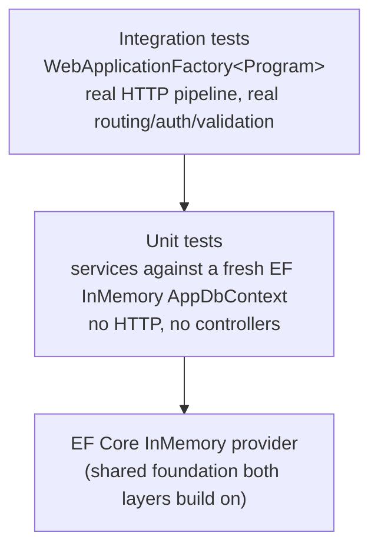

# Testing Strategy

21 tests, split across two layers with deliberately different jobs. Run
with:

```bash
dotnet test
```

## The pyramid here



Unit tests own the *business logic* — every branch of
`OrderService.CreateAsync`, the keyed-lock concurrency guarantee, exact
counter arithmetic. Integration tests own the *HTTP contract* — status
codes, auth/authz enforcement, request validation, and (for `Orders`) that
the full pipeline (`ValidationFilter` → controller → service →
`GlobalExceptionHandler`) actually wires together correctly end to end, not
just that the service class behaves correctly in isolation.

## Unit tests

### `OrderServiceTests` — the core flow, every branch

| Test | Scenario covered |
|---|---|
| `CreateAsync_HappyPath_ConfirmsOrderAndDebitsInventory` | Full success path — order `Confirmed`, inventory debited, 2-entry status history |
| `CreateAsync_InsufficientInventory_ThrowsAndCreatesNoOrder` | Availability check fails before any reservation — no order row created at all |
| `CreateAsync_PaymentDeclined_CancelsOrderAndReleasesInventory` | `"DECLINE"` sentinel — order ends `Cancelled`, inventory counters exactly restored |
| `CreateAsync_PaymentServiceUnavailable_CancelsOrderAndReleasesInventory` | `AlwaysThrowsPaymentApiClient` fake simulates a transport-level failure — same cleanup path as a decline, different exception type (`UpstreamServiceUnavailableException`) |
| `CreateAsync_DuplicateIdempotencyKey_ReturnsSameOrderAndDebitsOnce` | Same `Idempotency-Key` twice — second call returns the first order, inventory debited exactly once |
| `CreateAsync_UnknownProduct_ThrowsNotFound` | Request references a `productId` that doesn't exist in the catalog |
| `UpdateStatusAsync_InvalidTransition_ThrowsConflict` | State machine rejects an illegal transition (e.g. `Pending → Pending`) |

Talks to `IInventoryApiClient`/`IPaymentApiClient` through in-process
adapters (`Tests/Fakes/InProcessApiClients.cs`) that call the *real*
`InventoryService`/`PaymentService` directly rather than over a socket —
see the note in that file for why (a real `HttpClient` needs a real
listening port, which is awkward and unnecessary just to prove the business
logic is correct).

### `InventoryServiceTests` — the concurrency-sensitive core

| Test | Scenario covered |
|---|---|
| `ReserveAsync_InsufficientStock_ThrowsAndLeavesCountersUnchanged` | Over-requesting throws, no partial debit |
| `ReserveThenRelease_RoundTripsCountersExactly` | Reserve then release nets out to the original counters exactly |
| `ConcurrentReserve_NeverOversells` | **The one that matters most**: 10 units on hand, two `Task`s simultaneously reserve 7 each. Asserts exactly one wins, one gets `InsufficientInventoryException`, and final counters are consistent (`Available=3, Reserved=7`) — this is the actual proof that `KeyedLockProvider` (see [resilience-and-consistency.md](resilience-and-consistency.md#concurrency-for-context)) does its job, not just an assertion that the code compiles |

## Integration tests

All under `Integration/`, sharing `ApiFactory` (a `WebApplicationFactory<Program>`
with a fresh InMemory database name per test class).

| File | Scenario covered |
|---|---|
| `AuthTests` | Valid login returns a token; invalid credentials return `401` |
| `AuthorizationTests` | No token → `401`; non-admin token on an admin-only endpoint → `403`; admin token → `201` |
| `ProductsEndpointTests` | Validation failure → `400` with field-level detail; paginated list envelope shape; full create/get/update/delete lifecycle including post-delete `404` |
| `OrdersEndpointTests` | **New** — `POST /api/orders` through the real HTTP pipeline: happy path (`201`, `Confirmed`, inventory debited), insufficient stock (`409`, nothing reserved), declined payment (`402`, inventory fully released) |

`OrdersEndpointTests` needed one infrastructure change to exist at all:
`OrderService`'s typed `HttpClient`s are configured with a real loopback
base address in `Program.cs`, which doesn't resolve to anything inside
`WebApplicationFactory`'s in-memory `TestServer`. `ApiFactory` now swaps
`IInventoryApiClient`/`IPaymentApiClient` for the same in-process adapters
the unit tests use (`ConfigureTestServices` in `Integration/ApiFactory.cs`)
— so a test still exercises the real `OrdersController` →
`ValidationFilter` → `OrderService` → `GlobalExceptionHandler` pipeline,
just without a real socket underneath the Inventory/Payment hop.

## What's deliberately not covered

Gaps that are known and reasonable to leave for now, not blind spots:

- **Concurrent identical idempotency-key requests** — the unique index (see
  [resilience-and-consistency.md](resilience-and-consistency.md#idempotency))
  is untested under actual concurrency; only the sequential "call twice"
  case (`CreateAsync_DuplicateIdempotencyKey_...`) is covered.
- **Cancellation-safe compensation** — the fix described in
  [resilience-and-consistency.md](resilience-and-consistency.md#cancellation-can-prevent-compensation)
  has no regression test proving a cancelled request still leaves the order
  `Cancelled` with inventory released.
- **Reserve-endpoint retry/duplication** — no test for the known gap where a
  retried `ReserveAsync` call double-reserves (there's no dedup guard to
  test yet).
- **Role boundary on Inventory/Payment mutation endpoints** — no test
  documents that a non-admin authenticated user *can* call
  `POST /api/inventory/{id}/reserve` directly (intentional per
  [auth-and-security.md](auth-and-security.md), but undocumented in test
  form).
- **Optimistic concurrency (`RowVersion`) conflicts** — no test forces two
  concurrent updates to the same `Order`/`InventoryItem` to prove the
  `409` mapping actually fires.
- **Soft-delete + historical order snapshot interaction** — no test proves
  a soft-deleted `Product`/`Customer` still resolves correctly on a
  historical order via the snapshotted fields.
- **Pagination edge cases** — page past the last page, invalid `sort`
  field falling back to default, and `Skip`/`Take` vs `Page`/`PageSize`
  precedence.

None of these block submission — the core spec-mandated flow and its five
required error scenarios are all covered by a passing automated test. This
list is what a next round of hardening would prioritize.

## Seeded test credentials

Both unit and integration tests rely on `DataSeeder` (unit tests seed their
own minimal fixtures directly; integration tests hit the real seeded
startup data through `ApiFactory.GetTokenAsync`):

| Username | Password | Role |
|---|---|---|
| `admin` | `Admin123!` | Admin |
| `viewer` | `Viewer123!` | Customer |
