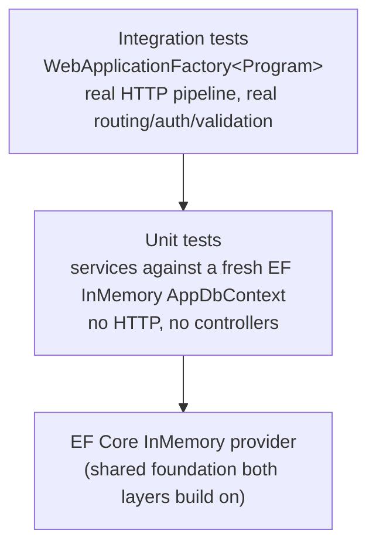

# Testing Strategy

31 tests, split across two layers with deliberately different jobs. Run
with:

```bash
dotnet test
```

## The pyramid here



Unit tests own the *business logic* — every branch of
`OrderService.CreateAsync`, the keyed-lock concurrency guarantee, exact
counter arithmetic. Integration tests own the *HTTP contract* — status
codes, auth/authz enforcement, request validation, and (for `Orders`) that
the full pipeline (`ValidationFilter` → controller → service →
`GlobalExceptionHandler`) actually wires together correctly end to end, not
just that the service class behaves correctly in isolation.

## Unit tests

### `OrderServiceTests` — the core flow, every branch

| Test | Scenario covered |
|---|---|
| `CreateAsync_HappyPath_ConfirmsOrderAndDebitsInventory` | Full success path — order `Confirmed`, inventory debited, 2-entry status history |
| `CreateAsync_InsufficientInventory_ThrowsAndCreatesNoOrder` | Availability check fails before any reservation — no order row created at all |
| `CreateAsync_PaymentDeclined_CancelsOrderAndReleasesInventory` | `"DECLINE"` sentinel — order ends `Cancelled`, inventory counters exactly restored |
| `CreateAsync_PaymentServiceUnavailable_CancelsOrderAndReleasesInventory` | `AlwaysThrowsPaymentApiClient` fake simulates a transport-level failure — same cleanup path as a decline, different exception type (`UpstreamServiceUnavailableException`) |
| `CreateAsync_CancelledDuringPayment_StillReleasesInventoryAndCancelsOrder` | `CancellingPaymentApiClient` fake cancels the inbound token mid-call, simulating a disconnected client — proves compensation still completes instead of throwing `OperationCanceledException` and stranding the order `Pending`. Verified as a genuine regression guard: reverting the `CancellationToken.None` fix makes this test fail with the exact original bug |
| `CreateAsync_DuplicateIdempotencyKey_ReturnsSameOrderAndDebitsOnce` | Same `Idempotency-Key` twice, sequentially — second call returns the first order, inventory debited exactly once |
| `CreateAsync_UnknownProduct_ThrowsNotFound` | Request references a `productId` that doesn't exist in the catalog |
| `UpdateStatusAsync_InvalidTransition_ThrowsConflict` | State machine rejects an illegal transition (e.g. `Pending → Pending`) |

Talks to `IInventoryApiClient`/`IPaymentApiClient` through in-process
adapters (`Tests/Fakes/InProcessApiClients.cs`) that call the *real*
`InventoryService`/`PaymentService` directly rather than over a socket —
see the note in that file for why (a real `HttpClient` needs a real
listening port, which is awkward and unnecessary just to prove the business
logic is correct).

### `InventoryServiceTests` — the concurrency-sensitive core

| Test | Scenario covered |
|---|---|
| `ReserveAsync_InsufficientStock_ThrowsAndLeavesCountersUnchanged` | Over-requesting throws, no partial debit |
| `ReserveThenRelease_RoundTripsCountersExactly` | Reserve then release nets out to the original counters exactly |
| `ConcurrentReserve_NeverOversells` | **The one that matters most**: 10 units on hand, two `Task`s simultaneously reserve 7 each. Asserts exactly one wins, one gets `InsufficientInventoryException`, and final counters are consistent (`Available=3, Reserved=7`) — this is the actual proof that `KeyedLockProvider` (see [resilience-and-consistency.md](resilience-and-consistency.md#concurrency-for-context)) does its job, not just an assertion that the code compiles |

### `ConcurrencyTests` — the `RowVersion` mechanism itself

| Test | Scenario covered |
|---|---|
| `ConcurrentInventoryItemUpdates_SecondSaveThrowsConcurrencyException` | Two separate `DbContext` instances (mirroring two HTTP requests) load the same `InventoryItem`, both mutate, first save wins — second save must throw `DbUpdateConcurrencyException` |
| `ConcurrentOrderUpdates_SecondSaveThrowsConcurrencyException` | Same proof against `Order` |

Deliberately bypasses `KeyedLockProvider` (constructs `AppDbContext`
directly rather than going through a service) — the point is to prove the
optimistic-concurrency mechanism (`AppDbContext.BumpRowVersions` +
`IsConcurrencyToken()`) works as a defense in depth on its own, independent
of the lock that normally prevents this race from ever reaching it in
practice.

## Integration tests

All under `Integration/`, sharing `ApiFactory` (a `WebApplicationFactory<Program>`
with a fresh InMemory database name per test class).

| File | Scenario covered |
|---|---|
| `AuthTests` | Valid login returns a token; invalid credentials return `401` |
| `AuthorizationTests` | No token → `401`; non-admin token on an admin-only endpoint → `403`; admin token → `201`; **plus** two tests proving a non-admin authenticated user *can* call `POST /api/inventory/{id}/reserve`/`release` and `POST /api/payments/process` directly — documenting that as intentional (see [auth-and-security.md](auth-and-security.md)) rather than leaving it an unverified assumption |
| `ProductsEndpointTests` | Validation failure → `400` with field-level detail; paginated list envelope shape; full create/get/update/delete lifecycle including post-delete `404` |
| `OrdersEndpointTests` | `POST /api/orders` through the real HTTP pipeline: happy path (`201`, `Confirmed`, inventory debited), insufficient stock (`409`, nothing reserved), declined payment (`402`, inventory fully released), **two concurrent requests sharing an `Idempotency-Key`** resolving to exactly one order (see callout below), and a soft-deleted `Product`/`Customer` still resolving correctly on their historical order via the snapshotted fields |
| `PaginationEdgeCaseTests` | A page past the last page returns an empty list, not an error; an unrecognized `sort` field falls back to the default instead of erroring; `skip`/`take` take precedence over `page`/`pageSize` when both are supplied, and the response envelope still reports the equivalent `page`/`pageSize` either way |

`OrdersEndpointTests` needed one infrastructure change to exist at all:
`OrderService`'s typed `HttpClient`s are configured with a real loopback
base address in `Program.cs`, which doesn't resolve to anything inside
`WebApplicationFactory`'s in-memory `TestServer`. `ApiFactory` now swaps
`IInventoryApiClient`/`IPaymentApiClient` for the same in-process adapters
the unit tests use (`ConfigureTestServices` in `Integration/ApiFactory.cs`)
— so a test still exercises the real `OrdersController` →
`ValidationFilter` → `OrderService` → `GlobalExceptionHandler` pipeline,
just without a real socket underneath the Inventory/Payment hop.

### The concurrent idempotency-key test found two real bugs

`Create_ConcurrentDuplicateIdempotencyKey_CreatesExactlyOneOrder` is worth
calling out specifically: firing two real, truly-concurrent HTTP requests
with the same `Idempotency-Key` (via `Task.WhenAll`, each hitting the full
pipeline with its own scoped `DbContext` — deliberately *not* the
lower-level, single-shared-context style the unit tests use, since that
would mask exactly this class of bug) surfaced two genuine issues that no
existing test had caught:

1. **The unique `IdempotencyKey` index doesn't do anything on EF Core's
   InMemory provider.** It's not just untested under concurrency — it was
   *silently non-functional*, verified by a sequential (non-concurrent)
   duplicate insert succeeding with no exception. Fixed with a
   `KeyedLockProvider` lock scoped to the idempotency key, which is what
   actually closes the race — see
   [resilience-and-consistency.md](resilience-and-consistency.md#idempotency).
2. **A stale-read bug in `InventoryService`** — reads before a lock-protected
   write (`GetByProductIdAsync`, called by the pre-reservation availability
   check) attached a tracked entity to the request's `DbContext`, which EF
   Core's identity map then handed back unchanged to `ReserveAsync`/
   `ConsumeReservationsAsync` instead of a fresh read, defeating the lock's
   entire purpose. Fixed with `AsNoTracking()` on read-only queries and
   `ReloadAsync()` inside every lock-protected mutation — see
   [resilience-and-consistency.md](resilience-and-consistency.md#concurrency-for-context).

Both are exactly the kind of bug that's invisible in a single-request test
or a code read-through, and only reproduces under genuine concurrency
across separate `DbContext` instances — the concrete argument for why this
test was worth writing rather than assuming the existing coverage was
"probably fine."

## What's deliberately not covered

Gaps that are known and reasonable to leave for now, not blind spots:

- **Reused idempotency key with a different payload** — currently silently
  serves the original result rather than rejecting the mismatch; would need
  hashing the request body alongside the key.
- **Concurrent duplicate `Reserve` requests bypassing `OrderService`** —
  the dedup fix (existing-`Active`-reservation check) is covered by unit
  tests calling `InventoryService` directly, but not by a true multi-request
  concurrency test the way the idempotency race is.
- **Explicit `/health` endpoint test** — the endpoint exists and is
  unauthenticated, but there's no automated check that it returns `200`.

None of these block submission — the core spec-mandated flow and its five
required error scenarios are all covered by a passing automated test, and
the two bugs found while building this suite (above) are exactly the kind
of thing "testing strategy" as a grading criterion is meant to reward.

## Seeded test credentials

Both unit and integration tests rely on `DataSeeder` (unit tests seed their
own minimal fixtures directly; integration tests hit the real seeded
startup data through `ApiFactory.GetTokenAsync`):

| Username | Password | Role |
|---|---|---|
| `admin` | `Admin123!` | Admin |
| `viewer` | `Viewer123!` | Customer |
